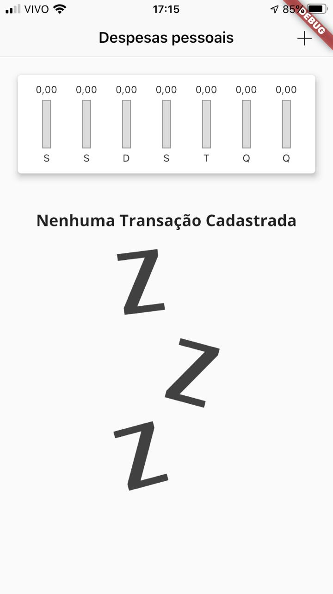
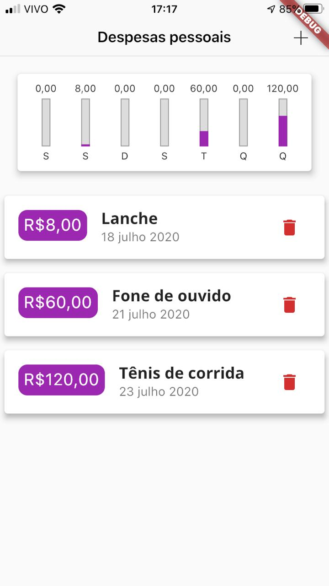
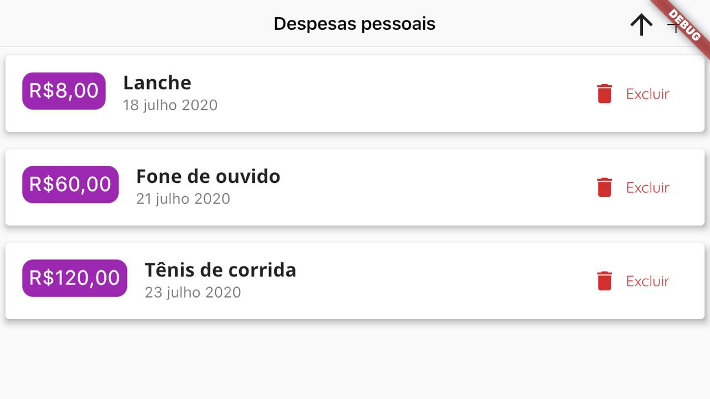
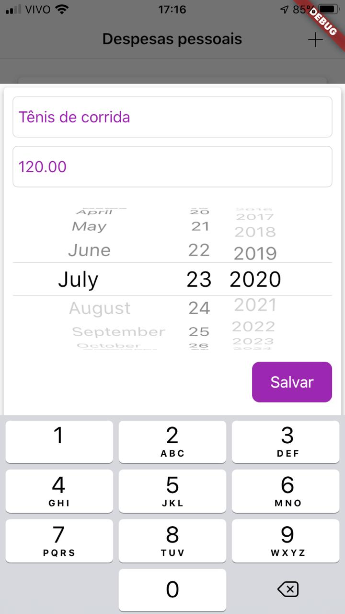
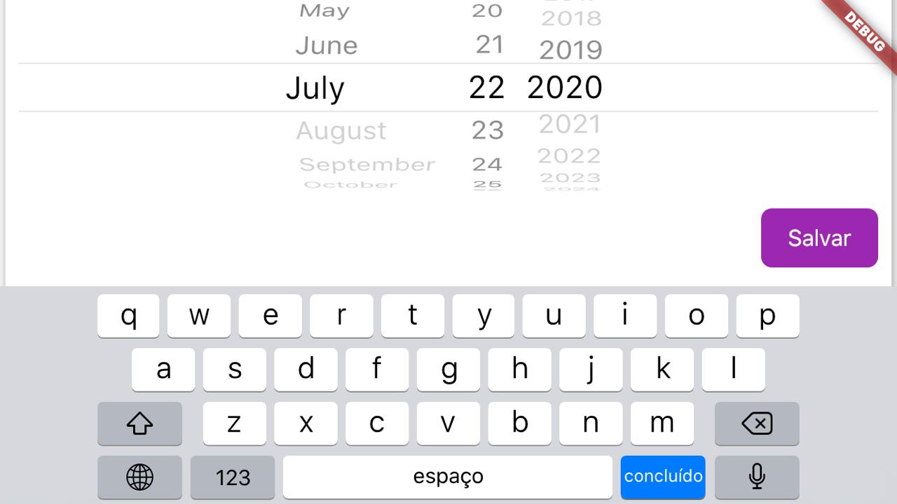

# expenses

A new Flutter project.

## An expenses control app. Developed with the flutter course from cod3r.

### Cupertino and Material

### Some Widgets

ListView.builder()

LayoutBuilder

Flexible

FittedBox

FractionallySizedBox

SingleChildScrollView

AdaptativeTextInput

AdaptativeDatePicker

